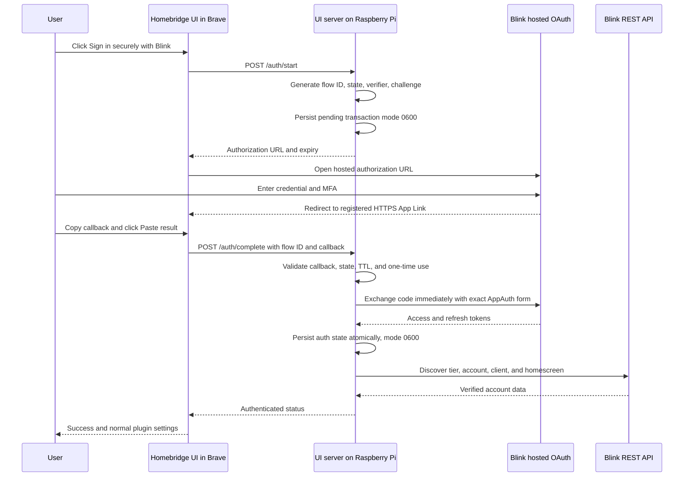

# Blink Hosted OAuth Login Design

> Historical implementation artifact. The supported runtime contract is now
> release `0.9.1`; use `docs/adr/001-authentication.md`, `blink_api_map.md`, and
> `docs/integration_checklist.md` for current behavior and evidence. In
> particular, a new production Homebridge session now tries the APK's ordinary
> `prod`, `prde`, `prsg`, and `a001` REST defaults only after HTTP 406, because
> the OAuth response itself supplies no account tier. Fresh packaged
> authorization-code exchange acceptance remains open.

**Date:** 2026-07-16

**Status:** Implemented; retained as the approved design record

**Decision owner:** Repository owner

**Beads issue:** `homebridge-blinkcameras-2yh`

## Summary

Replace the Homebridge custom UI's direct collection of Blink credentials and
OAuth MFA codes with Blink's native hosted sign-in experience. The Homebridge
instance on `raspberrypi.local` will create and retain a short-lived OAuth 2.0
Authorization Code with PKCE transaction. Brave will open Blink's hosted sign-in
page, where Blink handles credentials and MFA. After Blink redirects to its
registered Android App Link, the user will copy the final Brave address and use
a single **Paste Blink Result and Finish** action in the Homebridge UI. The Pi
will validate the callback, exchange the code immediately, persist the tokens,
discover the account tier, and verify normal API access.

This design requires no public callback service, inbound port, browser
extension, companion Android application, or Blink credential storage in
Homebridge configuration.

## Goals

- Keep all Blink password and OAuth MFA entry inside Blink's hosted UI.
- Let the user complete authentication using only the Homebridge custom UI and
  Brave, apart from reading Blink's MFA message in their normal message client.
- Make the remote Raspberry Pi the sole owner of the PKCE verifier and expected
  OAuth state.
- Exchange the callback immediately using the exact Android 57.1 AppAuth
  request contract.
- Persist access and refresh tokens durably before reporting success.
- Preserve login across Homebridge and custom-UI process restarts.
- Discover and persist Blink account, client, region, and tier information for
  EU and non-EU accounts.
- Retain the plugin's existing post-token client/account verification support
  when Blink reports that an additional REST verification step is required.
- Remove obsolete UI and documentation that instruct users to give their Blink
  password or OAuth MFA code to the plugin.

## Non-goals

- Registering a new OAuth client or redirect URI with Blink.
- Hosting a public OAuth relay.
- Installing an Android callback companion.
- Automating access to the user's password manager or message client as part of
  the released plugin.
- Changing camera, motion, or streaming behavior.
- Removing legacy authentication internals in the same release when they remain
  necessary to read or migrate an existing token file. They will not be exposed
  in the new end-user flow.

## Evidence and protocol contract

The design is based on Blink Android 57.1 build 29715642 and a live Brave test
performed on 2026-07-16.

The live test established all of the following without recording secret values:

- Blink accepted the Android authorization request in desktop Brave.
- Blink's hosted page completed password authentication and SMS MFA.
- Blink redirected to
  `https://applinks.blink.com/signin/callback` with a code and matching state.
- An immediate exact AppAuth token exchange returned HTTP 200 with access and
  refresh tokens and an access-token lifetime of 14,400 seconds.
- The access token returned HTTP 200 from `v1/users/tier_info`, `v2/users/info`,
  and the account homescreen endpoint.
- Refreshing with `client_id=android` and `scope=client` returned HTTP 200, and
  the refreshed access token was accepted by the REST API.
- The REST calls succeeded with the bearer token alone; no `TOKEN-AUTH` value
  was issued or required by this hosted flow.

The exact authorization-code exchange is:

```http
POST https://api.oauth.blink.com/oauth/token
Content-Type: application/x-www-form-urlencoded
Accept: application/json

grant_type=authorization_code
&redirect_uri=https%3A%2F%2Fapplinks.blink.com%2Fsignin%2Fcallback
&code=<one-time-code>
&code_verifier=<pi-owned-verifier>
&client_id=android
```

The exchange must not add `scope`, `app_brand`, `hardware_id`, cookies, a client
secret, Blink REST headers, or a browser user agent. Those extra values caused
the earlier proof-of-concept to diverge from Android AppAuth.

Refresh uses the APK's separate Retrofit contract:

```http
POST https://api.oauth.blink.com/oauth/token
Content-Type: application/x-www-form-urlencoded
Accept: application/json

refresh_token=<refresh-token>
&grant_type=refresh_token
&client_id=android
&scope=client
```

## User experience

### Signed-out state

The custom UI will show a concise explanation and one primary button:

1. **Sign in securely with Blink** starts a fresh Pi-owned transaction.
2. The UI opens a blank Brave tab synchronously from the user's click, requests
   the authorization URL from the custom-UI server, removes the new tab's
   `opener`, and navigates it to Blink. If Brave blocks the tab, the UI renders
   a normal **Open Blink Sign-In** link as a fallback.
3. The original Homebridge settings tab remains open and changes to a waiting
   screen with explicit callback instructions.

### Blink-hosted state

The user enters their saved Blink/Amazon account credentials and Blink's MFA
code only in the Blink-hosted page. The plugin never receives these values.

After successful MFA, Brave reaches Blink's registered App Link. On desktop it
currently renders an **Unsupported Browser** page while retaining the complete
callback in the address bar.

### Callback finish state

The waiting screen asks the user to copy the entire final Brave address, return
to Homebridge, and click **Paste Blink Result and Finish**.

The button calls `navigator.clipboard.readText()` only in direct response to the
click. If clipboard permission is unavailable, the same screen reveals a normal
paste field and submit button. The callback is cleared from the field and local
JavaScript variables as soon as it is handed to the server. After successful
exchange, the UI makes a best-effort attempt to clear the clipboard without
making success depend on clipboard write permission.

The success screen reports that Blink tokens are stored and verified. It must
not claim that credentials were saved. It then opens the normal Homebridge
schema configuration form.

## Architecture



### OAuth profiles

OAuth client identity will become an explicit profile rather than global
constants:

- `hostedAndroid`: client `android`, HTTPS App Link redirect, Android 57.1
  authorization metadata, exact AppAuth code exchange, and Android refresh.
- `legacyIos`: client `ios`, the legacy custom-scheme redirect, and current
  migration behavior for already-persisted sessions.

Every new token set stores its OAuth client ID. Existing state without an OAuth
client ID defaults to `ios` so an older refresh token is not silently refreshed
as the wrong client. New hosted sessions persist `android` and refresh as
`android`.

### Pending transaction coordinator

A focused coordinator will own the hosted transaction independently of the UI
HTML and Blink REST client. It will:

- generate 64 random verifier bytes and an S256 challenge;
- generate independent 32-byte state and flow identifiers;
- retain the exact client ID, redirect URI, hardware ID, and creation time;
- allow only one active transaction, replacing and invalidating an older one;
- persist the pending state in an owner-only file adjacent to `.blink-auth.json`;
- reload a valid pending transaction if the custom-UI child process restarts;
- reject and remove expired or malformed pending state;
- consume the transaction before attempting code exchange so concurrent or
  repeated submissions cannot reuse it;
- remove pending state after success, a state/flow mismatch, an OAuth error,
  expiry, logout, or replacement by a newer transaction. A merely malformed or
  partial paste does not destroy an otherwise valid pending transaction.

The pending transaction lifetime is 15 minutes. This limits exposure while
leaving enough time for password-manager interaction and MFA. The authorization
code is exchanged synchronously when `/auth/complete` receives it; there is no
intentional post-callback delay.

### Authorization URL

`/auth/start` builds the current Android request with:

- `client_id=android`
- `redirect_uri=https://applinks.blink.com/signin/callback`
- `response_type=code`
- `scope=client`
- `state=<random state>`
- `code_challenge=<S256 challenge>`
- `code_challenge_method=S256`
- `prompt=login`
- `hardware_id=<stable Homebridge device ID>`
- `app_brand=blink`
- `app_version=Version 57.1`
- `device_brand=Raspberry Pi`
- `device_model=Homebridge`
- `device_os_version=Android 14`
- `dark_mode=false`

The stable hardware ID comes from the saved plugin `deviceId`, defaulting to
`homebridge-blink`. The UI and runtime will use the same value; no temporary
random hardware ID will be generated.

### Callback validation

`/auth/complete` accepts an opaque string with a maximum length of 2,048 bytes
and a strict flow-ID format. The server parses it with `URL` and requires:

- scheme `https`;
- hostname exactly `applinks.blink.com`;
- no username, password, custom port, or fragment;
- pathname exactly `/signin/callback`;
- exactly one `state` parameter;
- either exactly one non-empty `code` or an OAuth `error`, never both;
- no duplicate code, state, error, or error-description parameters;
- a state whose bytes equal the pending value using a constant-time comparison;
- a matching flow ID and a transaction younger than 15 minutes.

An OAuth error is reported only after state validation. User-facing errors are
generic and actionable. Logs never include the callback URL, code, state,
verifier, token body, password, or MFA code.

### Token and account persistence

Token capture becomes asynchronous and must await the atomic owner-only write to
`.blink-auth.json` before `/auth/complete` reports success. Persisted state adds
the OAuth client identity and continues to store token expiry, account ID,
client ID, region, tier, email, hardware ID, and update time.

After the token file is durable, the existing Blink client will:

1. fetch `v1/users/tier_info` through the production bootstrap host;
2. update REST and shared REST bases to the returned tier;
3. fetch `v2/users/info`;
4. retain existing client/account verification handling if Blink requests it;
5. fetch the account homescreen as the live connection proof;
6. persist the discovered metadata before returning authenticated status.

This sequence supports production, EU, APAC, Australian, and numbered Blink
tiers because the tier response, not a UI guess, becomes authoritative.

## Custom-UI server API

### `POST /auth/start`

Input:

```json
{
  "deviceId": "homebridge-blink",
  "tier": "prod"
}
```

Output contains only the authorization URL, an opaque flow ID, and the expiry
timestamp. It contains no verifier or expected state outside their inclusion in
the authorization URL where required by OAuth.

### `POST /auth/complete`

Input:

```json
{
  "flowId": "<opaque-flow-id>",
  "callbackUrl": "<complete-Blink-callback>"
}
```

Success returns the existing redacted authenticated status shape. The route
does not echo the callback. Validation, OAuth, or REST failures return bounded
messages without upstream bodies or secret-bearing URLs.

### Existing routes

- `/status`, `/logout`, `/lock`, `/unlock`, and `/test-connection` remain.
- `/verify` remains only for distinct post-token client/account verification.
- The credential-submission `/login` path is removed from the custom UI and is
  not part of the supported end-user workflow.

## Configuration behavior

On hosted-login success, the custom UI will:

- save the stable `deviceId`, discovered `tier`, and `persistAuth=true`;
- remove `username`, `password`, OAuth MFA codes, and legacy verification-code
  fields from plugin configuration;
- keep `authLocked` semantics for normal token-only operation;
- never render a password or OAuth MFA input.

The platform continues to accept a configuration with no username/password and
loads the owner-only token state. Legacy paired credentials are not required for
the hosted flow and are not written back by the UI.

## Error handling and recovery

- **Popup blocked:** render a safe normal link using the server-provided URL.
- **Clipboard unavailable:** reveal a manual callback paste field.
- **Wrong or partial URL:** reject locally/server-side, retain the pending
  transaction, and keep guidance visible so the user can copy the complete
  Brave address and retry.
- **State or flow mismatch:** consume the pending transaction, show a security
  error, and require a fresh start.
- **Expired transaction:** remove it and require a fresh start.
- **Blink OAuth error:** validate state, consume the transaction, and show the
  bounded Blink error category.
- **Token exchange failure:** do not retry the one-time code; require a fresh
  hosted flow.
- **Tier or REST verification failure after token issuance:** keep the durable
  tokens, report that sign-in succeeded but connection verification failed, and
  allow `/test-connection` or refresh to recover.
- **Custom-UI process restart:** reload a valid pending transaction or the final
  persisted auth state from owner-only files.
- **Homebridge restart:** load `.blink-auth.json`, refresh as its persisted OAuth
  client, and discover devices without credentials.

## Security and privacy controls

- PKCE verifier and OAuth state are generated with Node cryptographic randomness.
- State comparison uses constant-time byte comparison.
- Pending and final auth files use atomic writes, reject symlinks and unsafe
  ownership/modes, and are written with mode `0600`.
- Callback length, URL structure, duplicate parameters, flow IDs, and OAuth
  fields are allow-listed.
- One active transaction and consume-before-exchange semantics prevent replay.
- UI server routes are already reachable only through the authenticated
  Homebridge Config UI channel; the coordinator still validates every payload.
- Callback values are never placed in plugin configuration, URLs controlled by
  Homebridge, browser local storage, analytics, events, or log messages.
- Redaction is extended to remove query-string `code` and `state` values from
  unexpected errors before they reach UI or Homebridge logs.
- Access and refresh tokens never cross back into browser JavaScript.
- The released plugin does not automate password-manager or Messages access.
- The live acceptance test may use the user's authorized iCloud Keychain and
  Messages locally, but those are test-operator actions outside plugin code.

## Test strategy

Implementation will follow red-green-refactor cycles.

### Unit tests

- Android authorization URL contains state, 64-byte-verifier S256 challenge,
  exact client/redirect, prompt, and current metadata.
- Wrong callback scheme, host, port, path, fragment, flow ID, state, duplicates,
  missing code, mixed code/error, oversized input, expiry, and replay all fail.
- Valid callback exchanges once with the exact five AppAuth fields and no extras.
- Pending state persists with mode `0600`, reloads after coordinator restart,
  and is removed on completion, replacement, expiry, and logout.
- Token completion does not resolve before durable persistence.
- New hosted refresh uses Android plus scope; legacy state without a profile
  continues to use iOS.
- Hosted bearer tokens work without a `TOKEN-AUTH` header.
- Post-token tier/account/homescreen discovery uses the discovered tier.

### Custom-UI tests

- HTML contains no Blink password or OAuth MFA input and makes no `/login`
  request.
- Start and complete requests contain no credentials.
- The external window has no opener; a blocked-popup fallback link is rendered.
- Clipboard read occurs only after a user click and has a manual-paste fallback.
- Callback fields and local variables are cleared after submission.
- Successful configuration removes legacy credential/code fields.
- User-visible copy describes stored tokens, not stored credentials.

### Regression gates

- Full Jest suite.
- ESLint.
- TypeScript build and custom-UI asset copy.
- `npm audit` with no known production vulnerability.
- Package contents inspection to ensure no APK, decompilation output, temporary
  callback, token response, or local machine artifact is included.

### Live Raspberry Pi acceptance test

1. Back up the existing `.blink-auth.json` on the Pi without reading or printing
   it; preserve owner and mode.
2. Build a unique local prerelease package and install it with `hb-service add`.
3. Restart Homebridge and verify the service, UI, and plugin child are active.
4. Open `http://raspberrypi.local:8581` in Brave and open the plugin settings.
5. Start hosted sign-in from the Homebridge UI.
6. Use the previously authorized iCloud Keychain Blink/Amazon credential in
   Blink's page.
7. Read the newest Blink MFA code from Messages and enter it only into Blink.
8. Copy the final Blink callback and use **Paste Blink Result and Finish**.
9. Verify UI success, owner-only auth-state persistence, tier/account/homescreen
   access, and device discovery without exposing secret values.
10. Restart Homebridge and verify the plugin remains authenticated and discovers
    the same account through refresh/persisted tokens.
11. If acceptance fails, reinstall version 0.8.1 and restore the untouched auth
    backup; otherwise retain the new hosted token state.

## Documentation and versioning

Implementation updates will replace obsolete claims in:

- `README.md`
- `docs/adr/001-authentication.md`
- `docs/integration_checklist.md`
- `docs/blink_api_dossier.md` where authentication conclusions are summarized

The ADR will become the canonical description of hosted OAuth, remote-Pi
topology, Android/HTTPS client profile, clipboard finish, persistence, refresh,
and residual private-API risk. Statements that initial authentication uses the
password grant, stores plaintext credentials, accepts OAuth MFA in Homebridge,
or lacks token persistence will be removed.

This is a backward-compatible user-facing feature and should advance the
pre-1.0 minor version to `0.9.0` once implementation and live acceptance pass.

## Alternatives considered

### Android intent bridge

A companion app could register for Blink's verified App Link and forward the
callback to the Pi. It reduces one copy gesture but requires installation,
pairing, a tablet or phone dependency, and another secret-bearing transport.
It violates the goal that ordinary users need only Homebridge UI and Brave.

### Public callback relay

A public TLS endpoint could receive a registered redirect and relay a result to
the Pi. Blink does not register a Homebridge redirect, so the relay would still
need to work behind Blink's fixed App Link. It also introduces hosting, account
correlation, availability, privacy, and abuse concerns. It is disproportionate
to a local Homebridge plugin.

### Direct credential submission from the Pi

The existing custom UI collects credentials and drives Blink's hosted forms
server-side. It is brittle, duplicates Blink's login UI, exposes credentials and
MFA to the plugin, and diverges from the current APK. It is not retained as the
supported user experience.

## Acceptance criteria

The implementation is complete only when all of the following are evidenced on
the actual Raspberry Pi instance:

- Homebridge UI starts a Pi-owned Android PKCE transaction.
- Brave completes Blink-hosted password and MFA interaction.
- Homebridge accepts the copied callback through the approved clipboard finish.
- The Pi validates state, flow, origin, path, TTL, and one-time use.
- Exact immediate AppAuth exchange returns access and refresh tokens.
- Tokens and OAuth client identity are durably persisted with safe ownership and
  mode before success is shown.
- Tier, account, client, homescreen, and camera discovery succeed.
- Homebridge restart succeeds without username, password, or OAuth MFA in config.
- Refresh succeeds using the persisted Android client and scope.
- Automated tests, lint, build, audit, and package inspection pass.
- Authentication documentation matches the APK, implementation, and live flow.
- Intended changes are committed and pushed while unrelated local files remain
  untouched.
